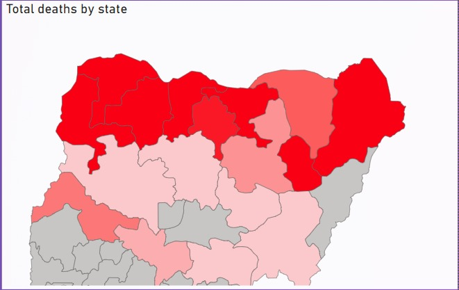
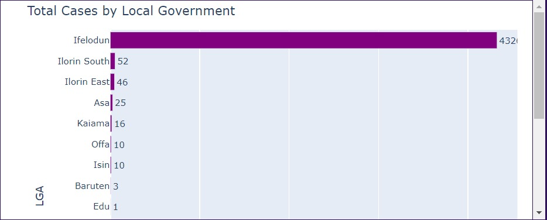
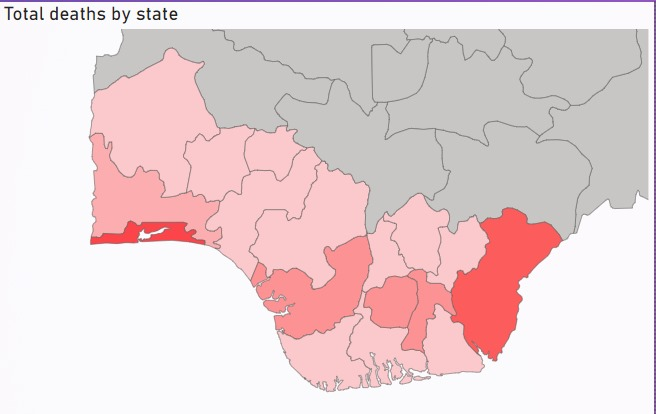
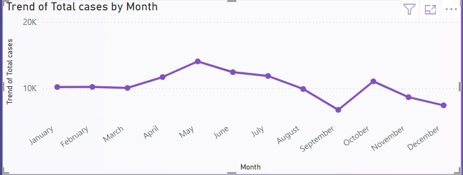

# Malnutrition Dashboard 

## Problem Statement
Malnutrition, in the context of undernutrition, represents a significant public health challenge, particularly in low to middle-income countries like Nigeria. Undernutrition is defined by specific criteria:

Neonates (newborns): Any newborn with a birth weight less than 2500 grams (5.5 lbs).
Children under five:
Children who are underweight, indicated by a weight-for-age Z-score of less than -2.

Malnutrition, contributes to severe morbidity and mortality, particularly among vulnerable populations such as children under five and pregnant and lactating women. The primary drivers of malnutrition include socio-economic conditions, inadequate water and sanitation, lack of nutritional education for mothers on how to feed babies and young children, and repeated infections. The most vulnerable populations are children under five and pregnant and lactating women.
Despite its critical importance, malnutrition is often underreported, leading to challenges in effectively addressing the issue.

## Data Context 

This dashboard focuses on data from the 2013 Nigerian Integrated Disease Surveillance and Response (IDSR) system to analyze malnutrition cases observed, reported, and investigated, along with total deaths attributed to malnutrition across various states and LGAs. Although the dataset originally included data from 2013 and 2015, discrepancies in the 2015 data—such as only 28 cases reported, all in Rivers State, with no deaths or investigations, This may be due to errors in data entry or errors from our data source, since we have means to further investigate this, that year was excluded from the analysis. As a result, this dashboard drills down to focus solely on the 2013 data.

## Data Cleaning
To ensure the dataset was focused and accurate for analyzing malnutrition among the under-five population, the following data cleaning steps were taken using Power BI's Power Query:

a. Filtering Disease Data: The dataset initially included multiple diseases such as malaria, typhoid fever, and pneumonia. The Disease column was filtered to retain only malnutrition data.

b. Age-Specific Aggregation: Columns containing malnutrition data for other age groups were removed. New columns were created to aggregate total cases observed, investigated, and deaths specifically for the under-five age group.

c. Sorting: The data was sorted by state, LGA, and month of the year to facilitate analysis by geographic and temporal factors.

d. Excluding 2015 Data: The dataset originally included data for 2013 and 2015. However, the 2015 data showed significant discrepancies, such as no recorded deaths across all states, which raised doubts about its accuracy. Since further investigation was not possible, the 2015 data was omitted, and the focus was placed solely on the 2013 data.

e. Date Formatting: The dataset contained month and year as separate columns, which could cause issues when plotting line graphs in Power BI. A new column was created to combine these into a proper date format, using the first day of each month as a reference.

f. Missing Data: It was observed that there was no data available for Adamawa state. No explanation or information was provided on the data page for this omission.

## Objectives:
1. Trend Analysis: Explore the malnutrition data for 2013 to identify trends and patterns that can inform public health strategies.
2. Geographic Focus: Highlight states and LGAs with the highest reported burden of malnutrition to guide targeted interventions.
3. Surveillance Insights: Analyze the relationships between observed, reported, and investigated cases to assess the effectiveness of the surveillance system in 2013.

## Impact and Relevance:
The insights gained from this analysis will be vital for public health officials, policymakers, and NGOs in designing interventions to reduce malnutrition in Nigeria. By concentrating on the more reliable 2013 data, this dashboard aims to provide a clear and accurate picture of the malnutrition landscape, aiding in the development of effective strategies to combat this issue.

## Data Limitations:
This analysis is limited to the 2013 data, as 2015 data was excluded due to significant discrepancies. Additionally, the dataset does not include specific nutritional indicators like birth weight, weight-for-age Z-scores, or MUAC measurements, focusing instead on reported cases and deaths.

## Data Analysis
According to the 2013 Integrated Disease Surveilance and Response dataset, a total of 124,288 cases of malnutrition were reported across Nigeria, resulting in 165 deaths and 7,126 investigations. The analysis revealed significant regional disparities, particularly between the northern and southern parts of the country.

### Regional Disparities

#### North West:

This region accounted for the majority of cases, with 81,000 reported (65% of the total). There were 109 deaths and 4,232 cases investigated.
Katsina State emerged as the most affected state with 21,135 cases, representing 17% of all cases nationwide. Jigawa State followed closely with 20,777 cases.  
These high numbers highlight the severe malnutrition crisis in the North West, driven by socio-economic challenges, limited healthcare access, and cultural factors.  
  
  

This bar chart shows the distribution of cases in the North west region. 

Although Katsina State had the highest number of cases, Jigawa State reported the highest number of deaths (54), pointing to differences in healthcare access and response within the North West.  
  

### North East:

The region reported 31,000 cases, making up 25% of the total cases. Despite these high numbers, the region accounted for only a fraction of the total deaths.
The North East’s figures are alarming, especially considering the ongoing conflict and displacement in the area, which exacerbate food insecurity and hinder access to healthcare.

### North Central:

With 6,931 cases, 4 deaths, and 75 investigations, the North Central region accounted for 5.6% of the total cases.
Kwara State had the highest number of cases within the region (4,491), with 95% of these reported in Ifelodun LGA. The concentration of cases in this LGA raises questions about localized factors contributing to malnutrition, such as poverty, education, and access to services.
  
  
This bar chart shows the distribution of cases in Kwara State. 

#### Southern Regions:

The South, encompassing the South West, South East, and South South regions, recorded only 5,357 cases, making up just 4.3% of the total cases. This stark contrast with the North underscores the deep socio-economic disparities between these regions.
South West:
1,936 cases were reported (1.5% of the total), with 6 deaths and 201 investigations.
The peak in cases during April (250) and the lowest in November (97) suggest a seasonal pattern that may be linked to food availability and healthcare access.
South East:
815 cases were reported, with 4 deaths and 113 investigations. The small number of cases (0.65% of the total) reflects the region's relatively better socio-economic conditions and health infrastructure.
South South:
2,630 cases were reported (2.1% of the total), with 6 deaths and 142 investigations. The data shows a peak in February (325 cases) and a decline to the lowest point in December.

  
This Bar chart shows the distribution of the total number of cases in the sourthern region of Nigeria. you can check the dashboard to take a more detailed look. 

  
This map shows the distribution of deaths in the southern region of Nigeria. you can check the dashboard to take a more detailed look. 

### Observations on Trends
Overall, malnutrition cases peaked in the middle of the year, between April and May, and gradually decreased until reaching their lowest point in September.

## Dashboard Development
This dashboard was initially built using Power BI Desktop. However, due to limitations in publishing to Power BI Service, I decided to rebuild the dashboard using Plotly Dash and deployed it on Render.